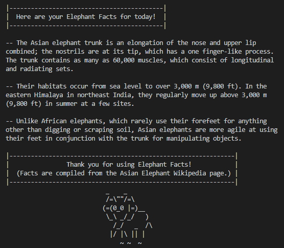

# Random Elephant Facts App
> Generates a random message including three facts about Asian elephants

## Table of contents
* [General info](#general-info)
* [Screenshot](#screenshot)
* [Technologies](#technologies)
* [Status](#status)

## General info
This project was an exercise intended to reinforce study in JavaScript programming syntax.  

## Screenshot

## Technologies
* JavaScript v1.7
* NodeJS v14.15.2

## Status
Project is: _finished_, project has met the goals of the programming objectives
